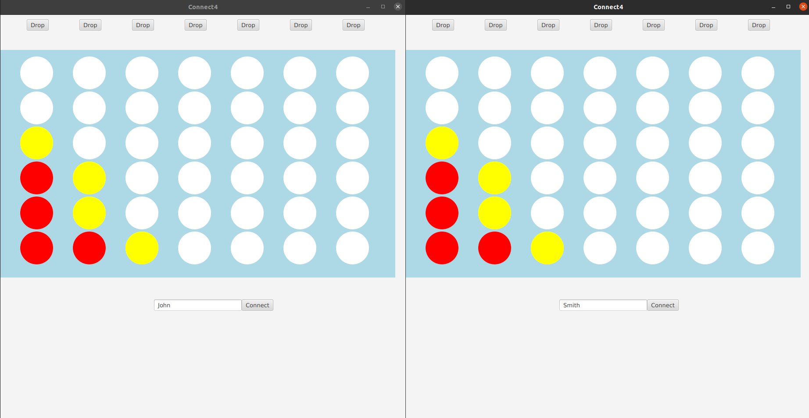

# Connect 4 Game

# Project Information
This program consists of a multi-client Connect 4 game using a server and sockets. 
By starting the server and 2 clients, you can then choose a username for both players
and press connect to join a game. One player starts with a move by pressing the button
of a column they want to drop a piece into. The board is updated and sent to the server
who then sends it to the other client, allowing them to make a move. This is repeated 
until a winning move is made by connecting 4, the win screen is then displayed and
game ends. A short video is included in the video folder in the repository that displays basic functionality 
and refer to "Comments/Analysis of Why the Program Doesn't Fully Work" for a better 
explanation of the current partially working program.

# How To Run
This program utilizes Gradle to run. Firstly, open the Connect4Server folder in IntelliJ (cannot use the Community Edition) 
and locate the Gradle tab on the far left and click it, this will open a window of files. Expand the Task 
directory then the application directory, now a "run" with a cogwheel icon should be displayed. 
Double click this "run" and this has successfully started running the server. Now follow the same steps inside the Connect4Client
folder and double click "run" two times to open 2 separate clients. You can now enter a username and press
connect on both to begin a match between the clients.

# Comments/Analysis of Why the Program Doesn't Fully Work
In our program we could not successfully get the socketing to work fully, we ran into problems with receiving the 
ArrayList from Server to Client to update it. We found that there was something missing within our Output and Input
Streams which was not recognizing the ArrayList we were sending as a string. We tried multiple recodes of these
interactions but could never quite get it to fully work as intended. Both games can run on separate clients with all
the Connect4 rules working with a win screen. The only interaction between them currently is when both connect to
the server it prints who you are paired with, this shows it recognizes both clients connecting to that one server.

# Other Resources
Use of the ChatServer Java Programming Example made in class

https://docs.oracle.com/javase/8/javafx/api/javafx/application/Platform.html#runLater-java.lang.Runnable-

https://www.codota.com/code/java/methods/java.util.ArrayList/toString

https://docs.oracle.com/javase/tutorial/networking/sockets/clientServer.html